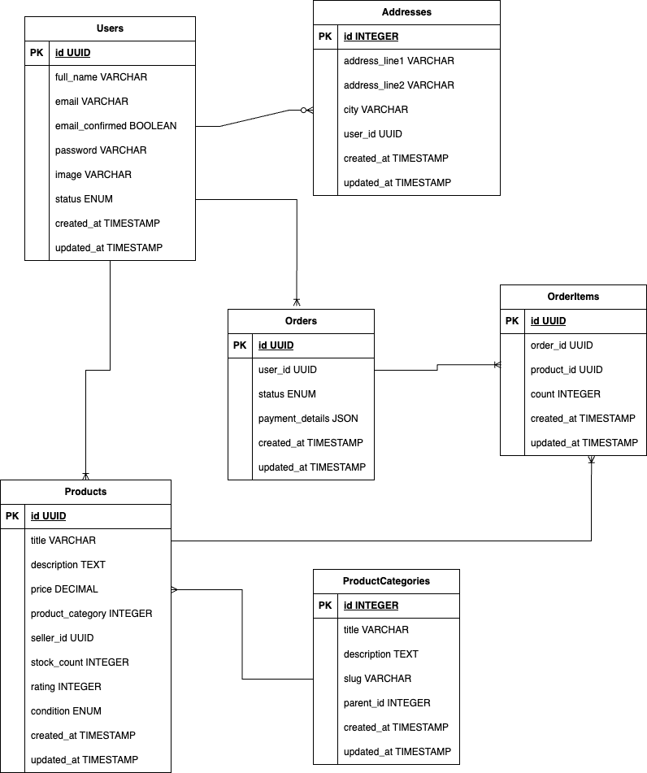

# Simple Full-Stack E-commerce App

To run the the server copy `.env.example` file to `.env` file and fill your db credentials:

```sh
cd server && cp .env.example .env
```

Entity Relationship Diagram is following:


